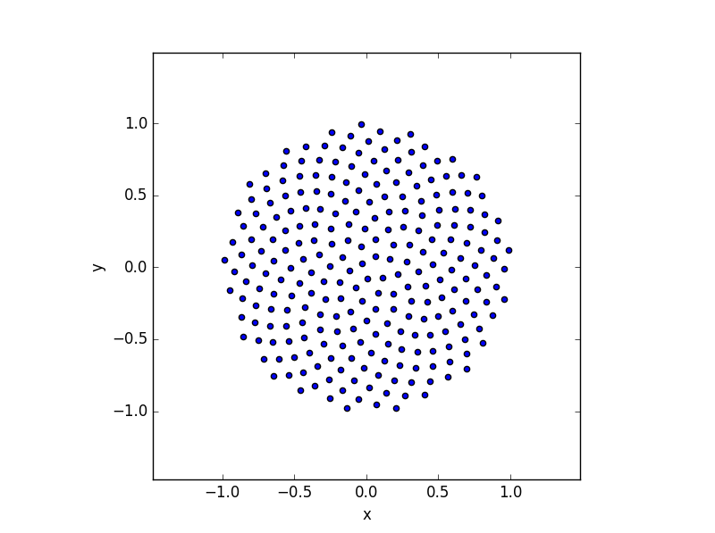
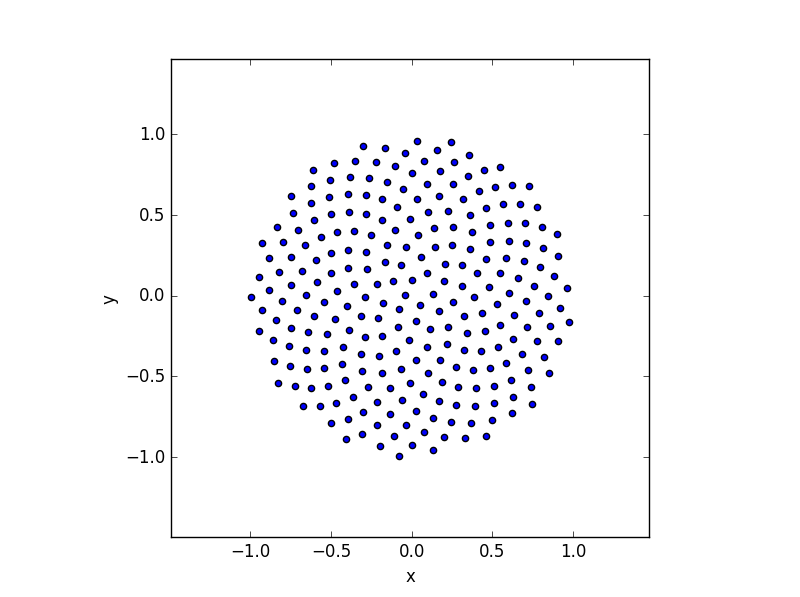
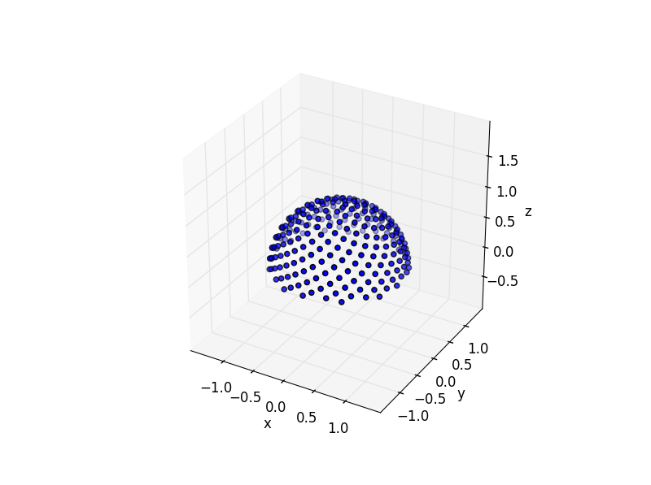
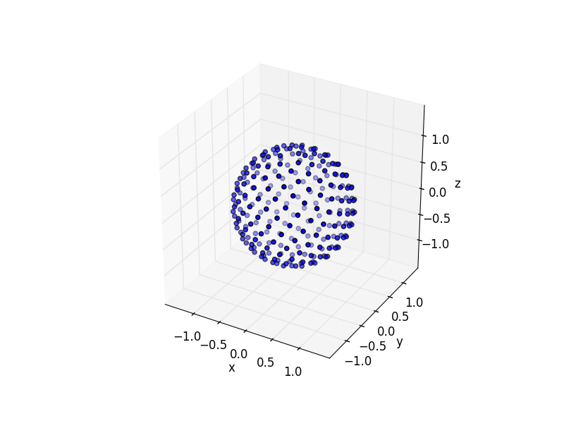
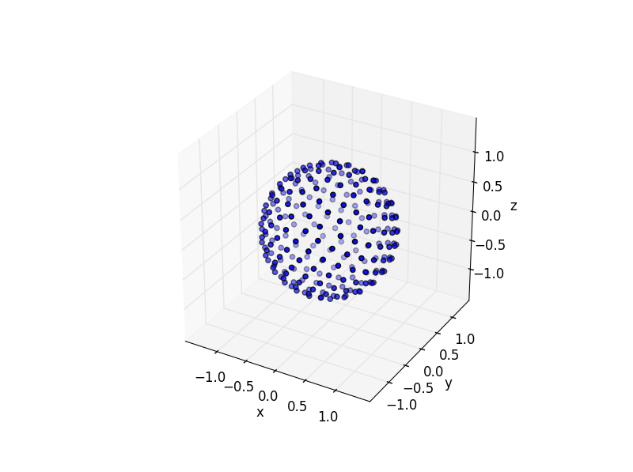
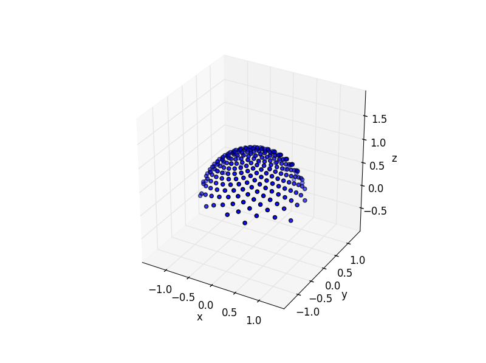

# fibpy

## About
Fibonacci spiral sampling (Quasi-Monte Carlo techniques) utilities.

## Use

### Sampling in unit circle (with jagged boundary)
<p align="center">


</p>
<p align="center">Default perturbation - Random perturbation</p>

### Sampling in unit circle (with smooth boundary)
<p align="center">


</p>
<p align="center">Default perturbation - Random perturbation</p>

### Sampling on unit hemisphere
<p align="center">


</p>
<p align="center">Default perturbation - Random perturbation</p>

### Sampling on unit sphere
<p align="center">


</p>
<p align="center">Default perturbation - Random perturbation</p>

### Cosine weighted sampling on unit hemisphere
<p align="center">


</p>
<p align="center">Default perturbation - Random perturbation</p>

```python
# Code
test.test()
```
